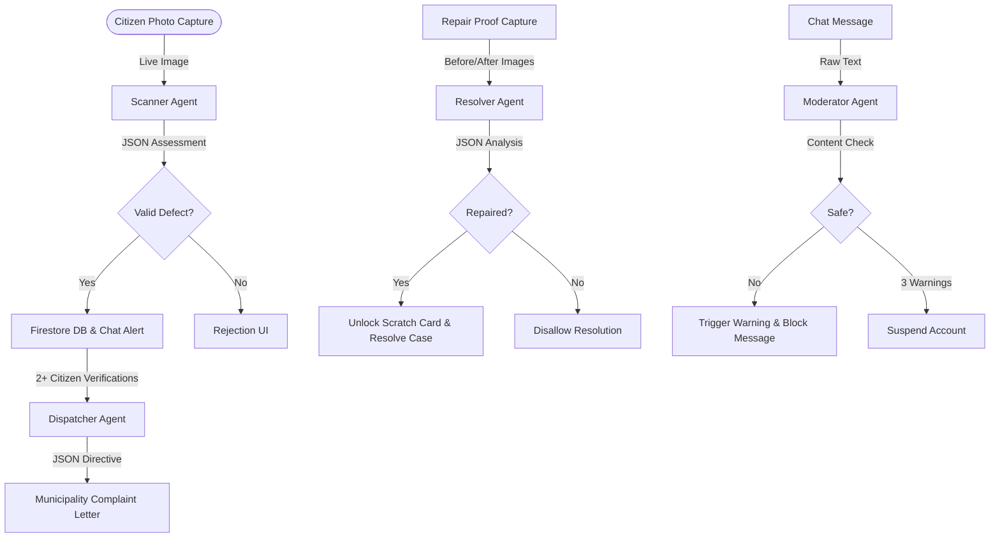

# 📡 Civic Succedent: Gamified Municipal Telemetry & AI Patrol Grid

<div align="center">
  
</div>

---

**Civic Succedent** is a full-stack, mobile-first, and highly gamified civic infrastructure monitoring platform. It empowers citizens to act as "Scouts," patrolling their local neighborhoods to log, verify, and resolve municipal defects (potholes, water leaks, broken streetlights, illegal garbage dumps) while earning XP, leveling up their rank, building passive-income structures in a simulation mode, and unlocking commercial reward coupons.

The platform utilizes advanced server-side **Gemini AI Agents** to analyze defect photos, moderate community chat, draft formal government complaint letters, and verify consensus-driven repairs.

---

## 🎮 Game Concept & Mechanics

### 1. The Scout's Progression (XP, Levels, & Ranks)
Every positive action in the neighborhood—reporting issues, verifying other reports, and submitting proof of repairs—earns you **XP** and **Coins**. As you accumulate XP, your level increases, unlocking higher military-grade civic ranks:

| Level | Rank | XP Required | Level-Up Reward | Coupon Code |
| :---: | :--- | :---: | :--- | :--- |
| **1** | **Scout** | *Starting* | Default Rank | None |
| **2** | **Scout Elite** | 500 XP | +100 Coins, +5% Trust Score | `CIVIC-CHAI20` (₹20 Chai Point) |
| **3** | **Patrol Ranger** | 1,200 XP | +200 Coins, +5% Trust Score | `CIVIC-ECO10` (10% Eco-Store Off) |
| **4** | **Ranger Captain** | 2,200 XP | +300 Coins, +5% Trust Score | `CIVIC-CAFE50` (₹50 Local Cafe Off) |
| **5** | **City Guardian** | 3,500 XP | +500 Coins, +10% Trust Score | `CIVIC-TRANSIT` (1 Mo. Eco-Transit Pass) |
| **6** | **Guardian Commander** | 5,000 XP | +750 Coins, +10% Trust Score | `CIVIC-AMZN200` (₹200 Amazon Gift Card) |
| **7** | **Champion** | 7,000 XP | +1,000 Coins, +10% Trust Score | `CIVIC-SHOW500` (₹500 BookMyShow Card) |
| **8** | **Legend** | 10,000 XP | +2,000 Coins, +20% Trust Score | `CIVIC-LEGEND` (₹1000 Store Gift Card) |

*Rank transitions trigger automated congratulatory announcements in the Community Chat.*

### 2. Scratch Cards & Rewards
* **Unlock Trigger**: Reporting a new defect or submitting a proof of repair successfully analyzed by the AI Resolver rewards you with a **Scratch Card**.
* **Scratch UI**: An interactive scratch-canvas overlay in your Profile View allows you to scratch and reveal randomized loot boxes containing bonus XP, Coins, and Trust Score boosts.
* **Milestone Coupons**: Coupons unlocked during level-ups are stored in your Profile under "My Rewards & Coupons" where you can copy the code to clipboard or mark it as redeemed.

### 3. Simulation Mode (Empire & HQ Pinned State)
Once you have pinned your **Civic Headquarters (HQ)** on the map (must be within 150m of your current GPS location to ensure local authority), you unlock **Sim Mode**:
* **Scout House (HQ)**: Placed instantly at your pinned location, giving passive coins income per hour. Can be upgraded from Level 1 to Level 3 to boost income.
* **Solar Grid**: Generates clean energy and +10 Coins/hr (Costs 150 Coins).
* **Repair Depot**: Speeds up verification times and generates +25 Coins/hr (Costs 300 Coins).
* **Tech Lab**: Conducts AI scans and generates +75 Coins/hr (Costs 800 Coins).
* **Valuation**: Represents the total net worth of your constructed infrastructure nodes.
* **Passive Collection**: Click on any building icon floating on the map to claim its accumulated passive coins.

---

## 📡 Feature Breakdown

### 🗺️ 1. Patrol Grid (AR Scouting)
* **Real-time Map tracking**: Interactive map utilizing Leaflet coordinates. Tracks your location and renders markers for active, disputed, and resolved defects.
* **Strict live Camera Capture**: File uploads are disabled to prevent AI-generated, spoofed, or pre-saved images. Citizens must take live, authentic photos using their device camera.
* **Consensus-Driven Verification**: Tap any marker reported by another user. You can vote "Yes" (confirming the issue exists) or "No/Dispute" (flagging it as resolved or fake).
* **Auto-escalation**: Reaching 2+ citizen verifications locks in consensus and automatically dispatches a formal complaint letter.

### 🚶 2. Safe Maps (Route Planner)
* **Hazard Avoidance Router**: Plan walking/driving paths using Geoapify Autocomplete and Routing APIs.
* **Avoidance Controls**: Select specific defect types to avoid (e.g. avoid pothole clusters or active waterlogging zones). The router automatically recalculates a safe path bypassing those markers.
* **Voice Assistance**: Features text-to-speech routing announcements (turn-by-turn navigation alerts) informing you of upcoming defects.

### 💬 3. WhatsApp/Telegram announcement Chat
* **Live Feed**: Full-screen message feed logging citizen discussions, level-ups, and auto-posts (reports, verifications, and resolutions).
* **Auto-Post Maps Integration**: Defect alerts in chat include a **"Tap to view on map"** action block. Clicking it teleports your map view directly to the defect coordinate.
* **Area & Query Filters**: Dropdown filters messages by neighborhood sector (e.g., Sector 5B). The persistent search input box matches both the message body and the sender's username.
* **Role-Based Metadata**: Messages render with custom role badges (`🤖 AI Agent`, `👑 Admin`, `🛡️ Scout`, `👤 Citizen`) based on their Firestore credentials.
* **Active Hero Leaderboard**: Bottom-sheet modal highlighting top neighborhood contributors ranked by XP and verifications.

---

## 🤖 Server-Side Gemini AI Agents

The backend Express server deploys four specialized Gemini AI Agents powered by the `@google/genai` SDK:



### 1. Scanner Agent (`src/agents/scannerAgent.ts`)
Processes the citizen's camera photo base64 payload.
* **Verification**: Detects if the image shows genuine outdoor civic damage.
* **Metadata Extraction**: Outputs structural JSON containing: `isValidReport` (boolean), `damageType` (enum), `severity` (1-10), `description` (brief summary), and `fraudScore` (0-100).
* **Automatic Rejection**: Indoor, domestic, or screenshot submissions are rejected with a helpful description (e.g., *"Rejection: The photo shows a wooden table, which is indoor furniture and not public civic infrastructure."*).

### 2. Resolver Agent (`src/agents/resolverAgent.ts`)
Runs when a user captures a photo claiming a defect is resolved.
* **Comparative Analysis**: Compares the original "before" image of the defect against the new "after" photo.
* **Validation**: Determines if the damage has been repaired (e.g., pothole patched, streetlight glowing).
* **Outcome**: Returns `resolved: true/false` and an explanation block.

### 3. Dispatcher Agent (`src/agents/dispatcherAgent.ts`)
Triggered automatically when a case reaches consensus (2+ verifications).
* **Directive Generation**: Drafts a formal, legally structured complaint letter addressed to the relevant municipality (e.g. BBMP in Bangalore, GHMC in Hyderabad).
* **Escalation Path**: Outlines a 30-day escalation hierarchy and draft Right to Information (RTI) query to hold local authorities accountable.

### 4. Moderator Agent (`src/agents/moderatorAgent.ts`)
Monitors the Community Chat.
* **Translation & Analysis**: Evaluates incoming message strings for profanity, hate speech, spam, or toxic behavior.
* **Escalation**: Blocks offending messages. Increments warning count on the user's Firestore document. On the 3rd warning, it permanently blocks their chat input access.

---

## 🛠️ Technology Stack
* **Frontend**: React 19, TypeScript, Tailwind CSS v4, Leaflet Map API, Lucide React icons, Motion animations.
* **Backend**: Node.js, Express, tsx, esbuild.
* **Database & Auth**: Firebase Auth and Cloud Firestore.
* **AI Engine**: Google GenAI SDK (`@google/genai`) running on `gemini-3.1-flash-lite`, `gemma-4-31b-it`, and `gemma-4-26b-a4b-it` models.

---

## 🚀 Installation & Local Run

### Prerequisites
* Node.js (v18 or higher)
* A Google AI Studio API key (obtainable at [Google AI Studio](https://aistudio.google.com))
* A Firebase Project with Auth (Email/Password) and Firestore enabled

### 1. Clone & Install Dependencies
```bash
git clone <your-repo-url>
cd civic-succedent
npm install
```

### 2. Configure Environment Variables
Create a `.env` file at the root of the project:
```env
# Gemini API Keys
GEMINI_API_KEY=your_gemini_api_key_starting_with_AIzaSy_or_AQ
GEMINI_SCANNER_MODEL=gemini-3.1-flash-lite
GEMINI_RESOLVER_MODEL=gemma-4-31b-it
GEMINI_DISPATCHER_MODEL=gemma-4-26b-a4b-it

# Firebase configuration parameters
VITE_FIREBASE_PROJECT_ID=your_project_id
VITE_FIREBASE_AUTH_DOMAIN=your_project_id.firebaseapp.com
VITE_FIREBASE_APP_ID=your_firebase_app_id
VITE_FIREBASE_API_KEY=your_firebase_client_api_key

# Geoapify Routing API key (Optional fallback is included)
VITE_GEOAPIFY_API_KEY=your_geoapify_key
```

### 3. Run Development Server
Runs both the Express backend API and the Vite frontend proxy server simultaneously:
```bash
npm run dev
```
Open **`http://localhost:3000`** in your browser.

---

## ☁️ Production Deployment

### 1. Backend Server Deployment (Render - Free Tier)
Since static hosting (like Firebase Hosting Spark plan) does not run Node servers, deploy the backend to a free service like **Render**:
1. Log in to [Render](https://render.com) and click **New > Web Service**.
2. Link your GitHub repository.
3. Configure the settings:
   * **Build Command**: `npm install && npm run build`
   * **Start Command**: `npm start`
4. Under **Environment Variables**, add all keys from your `.env` file (including `GEMINI_API_KEY` and Firebase variables).
5. Render will provide a public URL like `https://civic-succedent-backend.onrender.com`.

### 2. Frontend Deployment (Firebase Hosting - Spark Free Tier)
1. In the project root, create a file named `.env.production` and define `VITE_API_URL` pointing to your Render backend:
   ```env
   VITE_API_URL=https://civic-succedent-backend.onrender.com
   ```
2. Log in to Firebase CLI in your terminal:
   ```bash
   npx firebase-tools login
   ```
3. Compile the frontend build:
   ```bash
   npm run build
   ```
4. Deploy the static assets to Firebase Hosting:
   ```bash
   npx firebase-tools deploy --only hosting
   ```
   *Site is now live at `https://civic-succedent.web.app`!*