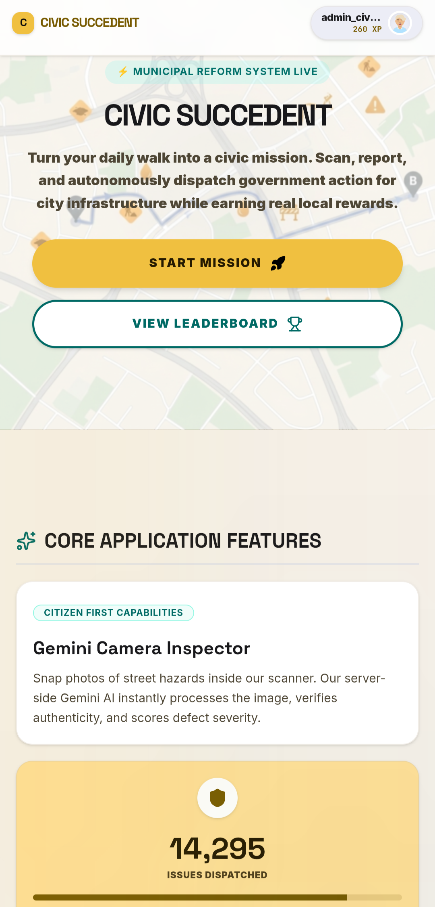
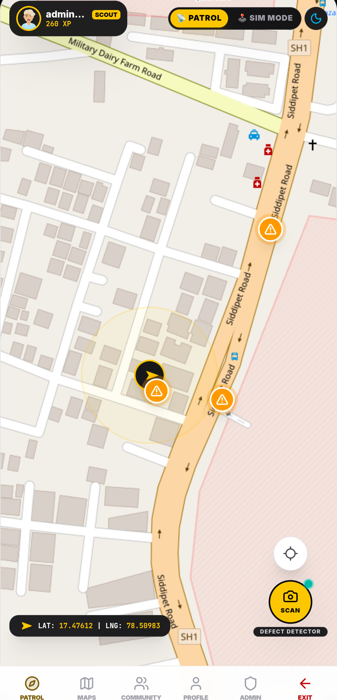
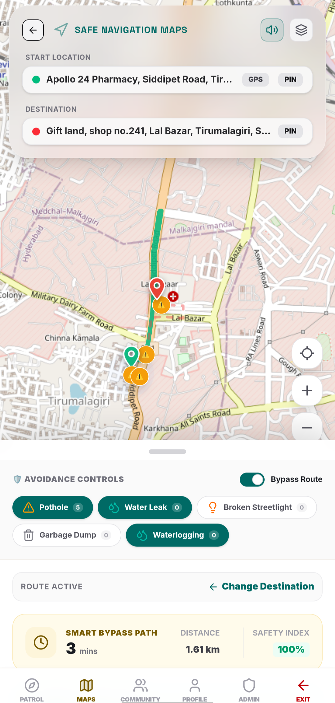
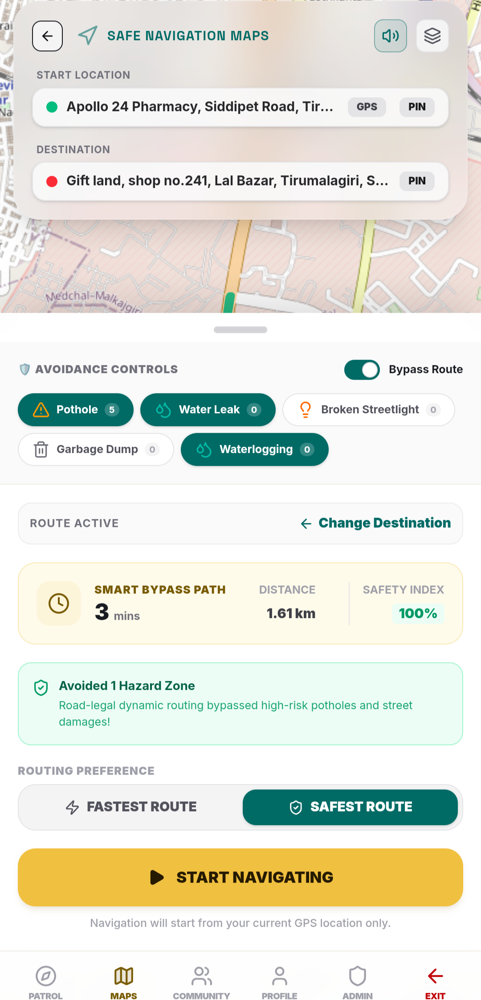
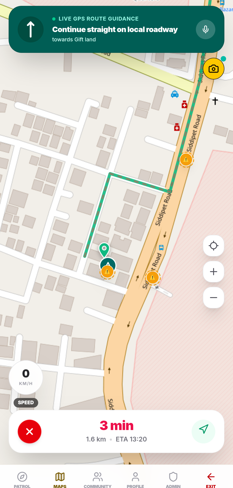
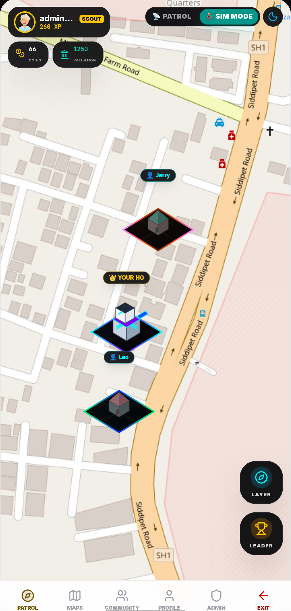
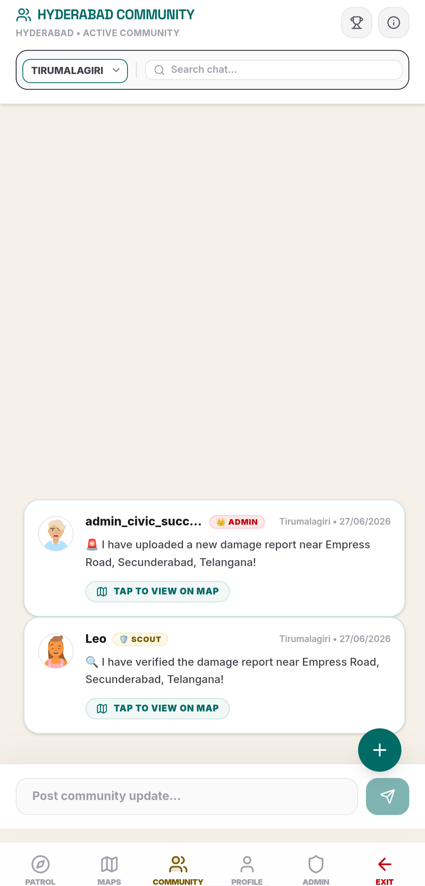
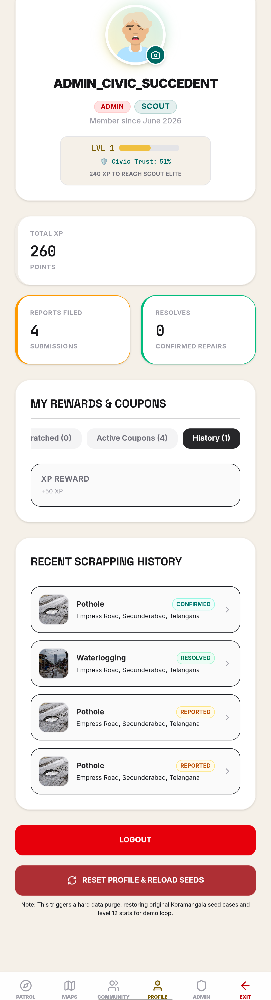
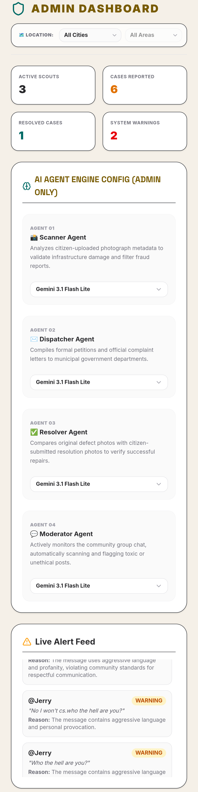
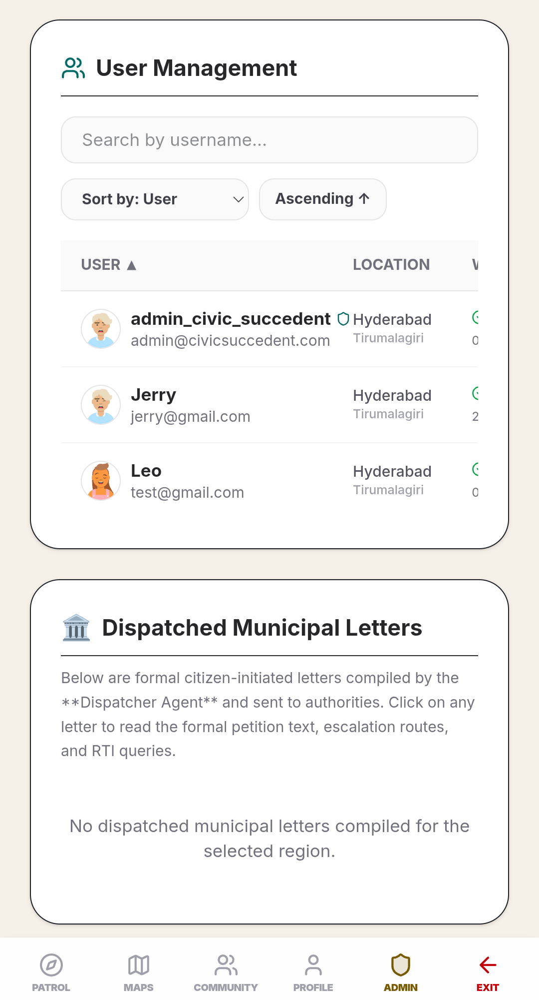

# Civic Succedent
**Submission for the Vibe2Ship Hackathon**  
*Problem Statement: Community Hero - Hyperlocal Problem Solver*

Gamifying citizen-led infrastructure reporting with multi-agent AI verification and real-time safe-route navigation.

---

## 🔗 Project Links
- **Deployed Application (Demo)**: [https://civic-succedent.web.app](https://civic-succedent.web.app)
- **GitHub Repository**: [https://github.com/PravAl2028/CIVIC-SUCCEDENT](https://github.com/PravAl2028/CIVIC-SUCCEDENT)
- **Demo Video Walkthrough**: [Watch on Google Drive](https://drive.google.com/file/d/14bvEB3wREINRScQapNA69ZW2RPKQIqpT/view?usp=sharing)

---

## 🎥 Demo Video

Watch the full walkthrough demonstrating Civic Succedent's live navigation routing, HQ gameplay, and multi-agent AI verification system:

[](https://drive.google.com/file/d/14bvEB3wREINRScQapNA69ZW2RPKQIqpT/view?usp=sharing)

---

## 🔑 Test Credentials (For Evaluators)
To test the application across different permission levels and roles, use the pre-configured accounts below:

| Role | Username / Email | Password | Details |
| :--- | :--- | :--- | :--- |
| **Admin** | `admin_civic_succedent` | `123456` | Accesses the Admin Control Panel, chats audit, and locks/unblocks flagged users. |
| **User 1** | `Leo` | `123456` | Active Scout (Ranger rank) with established HQ Empire and active cases. |
| **User 2** | `Jerry` | `098765` | Active Scout. |
---

## 📸 Visual Walkthrough & Features

Here is a visual walkthrough of the application's core functionality, using screenshots from the running portal:

### 1. Landing Page
The portal homepage highlighting the Gemini Camera Inspector and real-time civic mission entry.


### 2. Main Patrol Dashboard & Defect Detector
The primary interface showing the real-time map, current scout location, active hazard warning markers, and coordinate HUD.


### 3. Safe Navigation Route Planner
Bypass routing controls allowing scouts to dynamically plan routes that completely avoid active hazard zones.


### 4. Route Preferences (Safest vs. Fastest)
Selection panel for routing preferences showing the avoided hazard details and safety index score.


### 5. Turn-by-Turn GPS Navigation HUD
Active turn-by-turn guidance mode with a real-time speedometer, guidance banners, and reporting integration.


### 6. Gamified Empire Builder (HQ Simulation)
The Headquarters building interface showing the scout's base, valuation counters, and neighboring scouts' bases.


### 7. Local Community Chat Lounge
Active community lounge for Hyderabad showing localized warnings, reports, and AI-moderated chat logs.


### 8. Scout Profile & Rewards Hub
Profile dashboard showing total XP, reports filed, resolves statistics, rewards scratching history, and seed control.


### 9. AI Agent Configuration Console
Admin control panel for configuring Gemini model engine models (Scanner, Dispatcher, Resolver, Moderator) in real-time.


### 10. Admin User Management & Dispatch Log
Admin user moderation tools, warning audit logs, and dispatched municipal letters history.


---

## ⚠️ The Problem
Civic infrastructure damage — potholes, water leaks, broken streetlights — routinely goes unreported. Existing channels are fragmented, slow, and provide no incentives for community action. At the same time, pedestrians have no real-time way to know which routes are actually safe until they walk straight into active hazards.

## 💡 The Solution
Civic Succedent turns spotting a hazard into a rewarding game loop:
1. **Scan** the hazard with your phone camera.
2. Let a **Gemini-powered multi-agent pipeline** verify and score it.
3. Once the community consensus verifies the report, the app **automatically reroutes pedestrians** around the hazard in real-time.

---

## 🎮 How It Works

### 1. Patrol & Detect
Scout on foot with real-time GPS tracking or switch to the **on-screen virtual joystick simulator** to explore anywhere. Either mode sweeps a 30-meter proximity radius for nearby unverified reports. The in-app camera captures the hazard on the spot. Each new report earns **+50 XP**.

### 2. AI Appraisal
A server-side **Gemini Scanner Agent** analyzes uploaded images. It confirms the photo shows a genuine outdoor civic hazard (not household clutter) and assigns a severity score (1–10). Full community consensus requires 3 neighborhood approval votes.

### 3. Safe Navigation
Confirmed hazards feed directly into a live **OSRM (Open Source Routing Machine) engine** that reroutes walkers around active defect coordinates. The system includes custom route toggles designed specifically for kids, seniors, and cyclists.

### 4. HQ Empire
Manage your municipal base to generate passive offline coin income! Players can build and upgrade the **Base Cabin**, **Solar Grid Array**, and **Repair Depot Wing** (each Level 1–3) to compound offline yields, earning up to **~285 coins/hour** at max level.
- At **User Level 3**, scouts unlock the ability to relocate their home base for 500 Coins to a new, non-overlapping location on the public map.

### 5. Community Consensus
Connect with neighborhood scouts inside an AI-moderated chat lounge. A **Moderator Agent** filters chat spam and toxic messages with a 3-strike penalty. Verifying reported hazards or building updates automatically logs activity in the chat. Two or more verifications trigger an automated official complaint draft.

### 6. Reward Loop
Spend your earned Civic Coins on digital **Scratch Cards** to win simulated vouchers, badges, or profile cosmetics (100% in-game fun only).

---

## 🤖 Multi-Agent AI Pipeline
Four Gemini-powered server-side agents handle the moderation, validation, and economy mechanics of the application:

| Agent | Role Tag | Description / What It Does |
| :--- | :--- | :--- |
| **Scanner** | `Visual Inspector` | Analyzes uploaded camera snapshots, validates that it shows public outdoor damage, flags duplicates, and rates severity (1-10). |
| **Moderator** | `Quality Guardian` | Audits community chat logs, filters toxic contents, and tracks neighborhood consensus votes. |
| **Dispatcher** | `Alert Architect` | Geocodes coordinates, formats case files, and drafts official municipal complaint letters when a case receives 2+ verifications. |
| **Resolver** | `Economy Director` | Reviews "before" vs "after" repair photos to confirm resolution, updates user levels/XP, and calculates offline HQ coin yields. |

---

## 🛠️ Technical Stack
- **Frontend**: React 19, TypeScript, Vite, Tailwind CSS, Leaflet.js, Motion, Lucide Icons.
- **Backend API**: Node.js, Express.
- **Database & Auth**: Firebase Auth and Cloud Firestore (real-time listeners).
- **APIs & SDKs**: Google GenAI SDK (`@google/genai`), Geoapify Geocoding API, OSRM.

This application was designed, built, and optimized using **Google AI Studio** and the agentic AI coding assistant **Antigravity**.

---

## 🚀 Installation & Local Setup

### Prerequisites
- Node.js (v18 or higher)
- Google AI Studio API Key (Gemini)
- Firebase Project with Auth and Firestore enabled
- Geoapify API Key

### 1. Install Dependencies
```bash
npm install
```

### 2. Environment Configuration
Create a `.env` file in the root directory:
```env
GEMINI_API_KEY=your_gemini_api_key
GEMINI_SCANNER_MODEL=gemini-3.1-flash-lite
GEMINI_RESOLVER_MODEL=gemma-4-31b-it
GEMINI_DISPATCHER_MODEL=gemma-4-26b-a4b-it

VITE_FIREBASE_PROJECT_ID=your-project-id
VITE_FIREBASE_AUTH_DOMAIN=your-project-id.firebaseapp.com
VITE_FIREBASE_APP_ID=your-app-id
VITE_FIREBASE_API_KEY=your-client-api-key

VITE_GEOAPIFY_API_KEY=your_geoapify_key
```

### 3. Run the Application
Start the backend Express server and the Vite dev server concurrently:
```bash
npm run dev
```
Open `http://localhost:3000` in your browser.